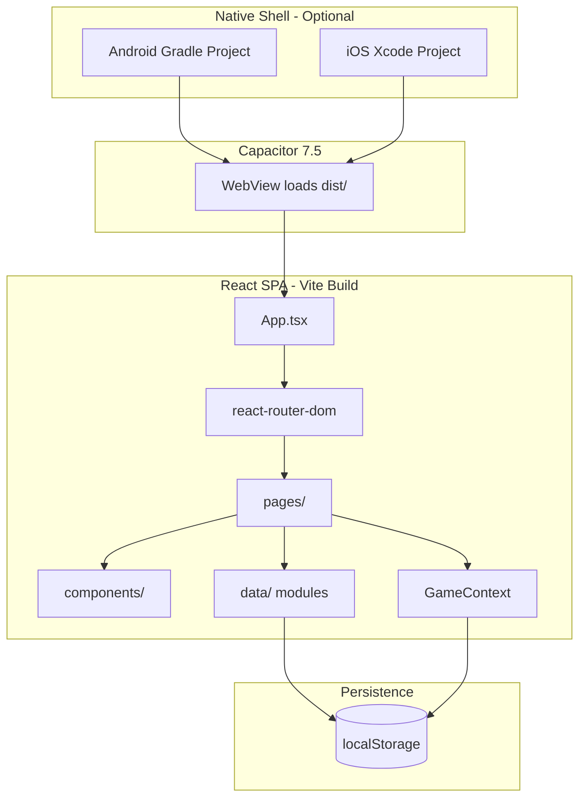
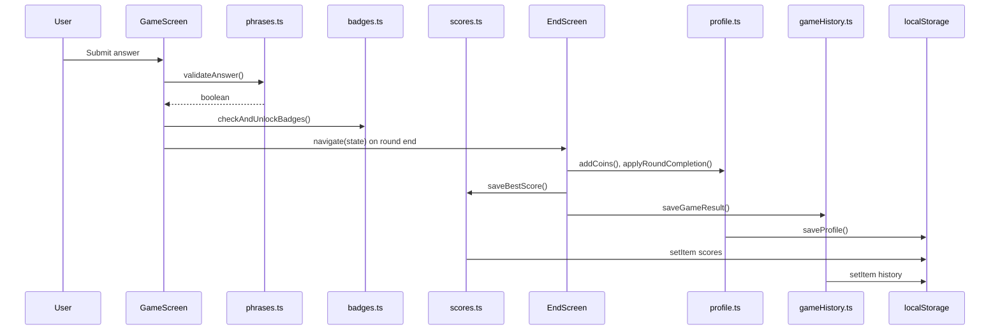
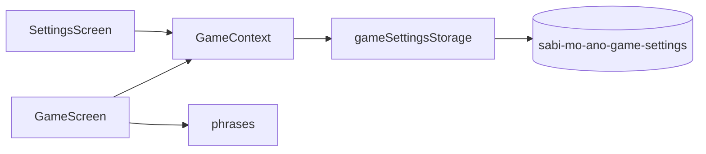
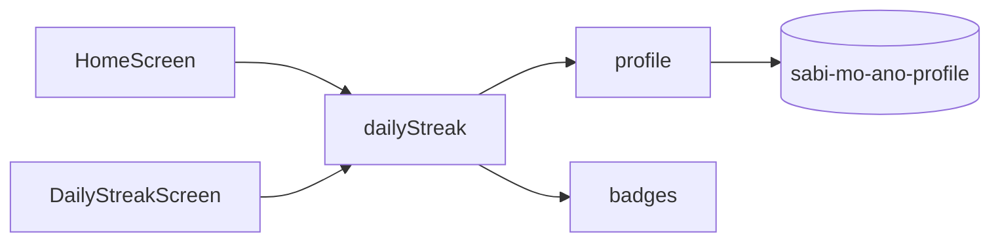
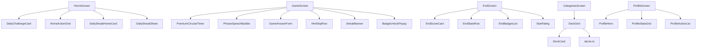
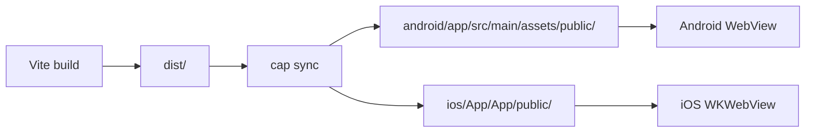
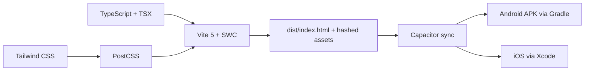

# System Architecture — Anu-Sabi

> Describes the application architecture **as implemented today**.  
> **Source:** Repository root (`src/`, `android/`, `ios/`)  
> **Last updated:** 2026-07-08

---

## Application overview

Anu-Sabi is a **client-only** single-page application. Players decode phonetic gibberish phrases through a timed guessing game. The app runs in a browser or inside a **Capacitor WebView** on Android/iOS.

There is **no server**, **no API**, **no SQLite**, and **no environment-variable configuration** in the current codebase.

---

## Current architecture diagram

---

## Frontend architecture

| Layer | Location | Responsibility |
|-------|----------|----------------|
| Entry | `src/main.tsx` | React DOM mount, imports `index.css` |
| App shell | `src/App.tsx` | Providers, route table |
| Pages | `src/pages/` | Screen-level components, local state, navigation |
| Feature components | `src/components/{domain}/` | Reusable UI by feature area |
| UI primitives | `src/components/ui/` | shadcn/Radix components (~45 files) |
| Data / logic | `src/data/` | Persistence, domain functions |
| Shared types | `src/types/game.ts` | Core TypeScript interfaces |
| Hooks | `src/hooks/` | `useTimer`, toast, mobile breakpoint |
| Utils | `src/utils/` | Audio, haptics, hints, labels |
| Styles | `src/styles/` | Premium theme CSS |

**Layout pattern:** No dedicated `layouts/` folder. Each page composes `PremiumTopBar`, `PremiumBottomNav`, and `premium-home` CSS on a `max-w-md` centered column.

---

## Data flow

### Game session flow

### Settings flow

### Daily Streak flow

---

## Component relationships

**Shared chrome:** `PremiumTopBar` (coins), `PremiumBottomNav` (Home / Play / Medals / Profile) used across most screens.

---

## State management

| State type | Mechanism | Scope |
|------------|-----------|-------|
| Game settings | `GameContext` + `localStorage` | Global (category, mode, difficulty) |
| App settings | `loadSettings()` / `saveSettings()` | Global (sound, haptics) |
| Profile / economy | `loadProfile()` / `saveProfile()` | Global (read on demand, no context) |
| Active game session | `useState` in `GameScreen` | Session (score, streak, phrase index) |
| End screen payload | `react-router` `location.state` | One-time navigation |
| UI overlays | Local `useState` per page | Page-scoped |

**Not used:** Redux, Zustand, MobX. **React Query** is wired (`QueryClientProvider`) but no `useQuery`/`useMutation` calls exist.

---

## Persistence model

**Storage:** Browser `localStorage` only.

| Key | Module | Content |
|-----|--------|---------|
| `sabi-mo-ano-profile` | `profile.ts` | Player profile, coins, streaks, rank |
| `sabi-mo-ano-settings` | `profile.ts` | Sound/haptics toggles |
| `sabi-mo-ano-game-settings` | `gameSettingsStorage.ts` | Category, mode, difficulty |
| `sabi-mo-ano-scores` | `scores.ts` | Best scores per mode+difficulty |
| `sabi-mo-ano-badges` | `badges.ts` | Unlocked badge ID array |
| `sabi-mo-ano-game-history` | `gameHistory.ts` | Last 50 game sessions |

**Static in-memory data:** 500 phrases (`phrases.ts`), 22 badge definitions, 9 deck metadata entries, stub leaderboard players.

**Migrations:** None. New profile fields merge via `{ ...DEFAULT_PROFILE, ...stored }` on load.

---

## Capacitor architecture

| Config | Value (`capacitor.config.ts`) |
|--------|-------------------------------|
| `appId` | `com.sabimoano.game` |
| `appName` | `Sabi Mo Ano` |
| `webDir` | `dist` |
| Live reload | Commented out (not active) |

**Native entry points:**
- Android: `android/app/src/main/java/com/sabimoano/game/MainActivity.java`
- iOS: `ios/App/App/AppDelegate.swift`

---

## Build architecture

| Stage | Command | Output |
|-------|---------|--------|
| Dev | `npm run dev` | `localhost:8080` HMR |
| Production | `npm run build` | `dist/` |
| Native sync | `npm run cap:sync` | Copies to `android/`, `ios/` |
| Android run | `npm run cap:android` | Device/emulator |
| iOS run | `npm run cap:ios` | Simulator/device |

---

## Current limitations

| Limitation | Status | Detail |
|------------|--------|--------|
| No backend | Planned — not in repository | No accounts, sync, or real multiplayer |
| No SQLite | Complete (by design) | All persistence is `localStorage` |
| No analytics SDK | Planned — not in repository | Not integrated |
| Leaderboard data | Stub | Hardcoded players in `leaderboard.ts` |
| Static content | Complete (by design) | 500 hand-authored phrases; no procedural generation |
| XP persistence | Partial | Display-only on end screen |
| Strict TypeScript off | Known gap | `strictNullChecks: false` in tsconfig |
| Single-device data | Complete (by design) | Clearing browser storage resets progress |
| No env config | Complete (by design) | No `.env` or `VITE_*` variables |

---

*See also: [CURRENT_IMPLEMENTATION.md](../implementation/CURRENT_IMPLEMENTATION.md), [TECH_STACK.md](../engineering/TECH_STACK.md)*
