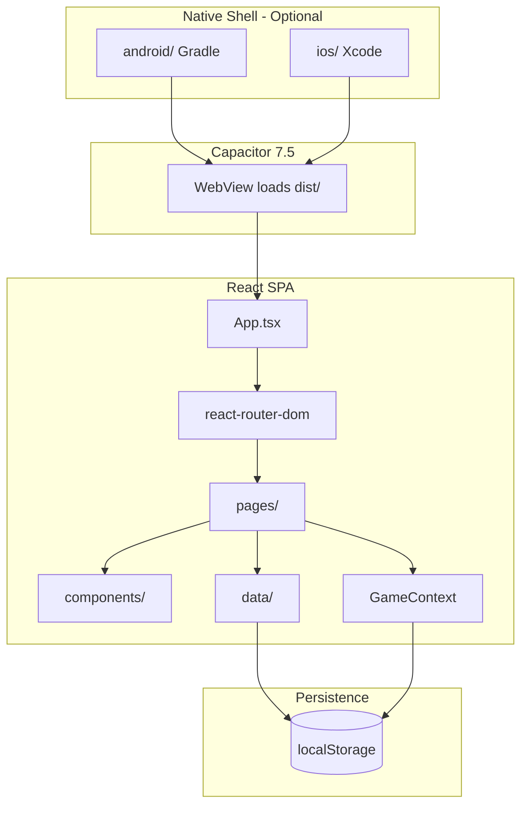
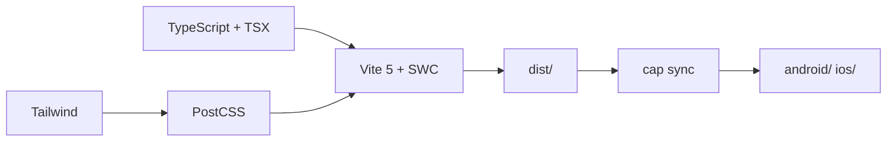

# 02 — Architecture

> System design as implemented today.  
> **Last updated:** 2026-07-08

---

## Overview

Anu-Sabi is a **client-only React SPA**. Optional **Capacitor** shell wraps the same `dist/` bundle for Android/iOS WebViews.

There is **no server**, **no API**, **no SQLite**, and **no environment configuration**.

---

## Architecture diagram



---

## Frontend layers

| Layer | Path | Responsibility |
|-------|------|----------------|
| Entry | `src/main.tsx` | React mount, global CSS |
| Shell | `src/App.tsx` | Providers, route table |
| Pages | `src/pages/` | Screen orchestration, local state |
| Feature UI | `src/components/{domain}/` | Domain components |
| Primitives | `src/components/ui/` | shadcn/Radix (~45 files) |
| Data | `src/data/` | Persistence + domain logic |
| Context | `src/context/GameContext.tsx` | Game settings (category, mode, difficulty) |
| Types | `src/types/game.ts` | Shared TypeScript types + multiplier helpers |
| Hooks | `src/hooks/` | Timer, toast, mobile breakpoint |
| Utils | `src/utils/` | Audio, haptics, hints, labels |
| Styles | `src/styles/` | Premium theme CSS |

**Layout:** No `layouts/` folder. Pages compose `PremiumTopBar`, `PremiumBottomNav`, `max-w-md` centered column.

---

## Providers (App.tsx)

```text
QueryClientProvider
  └── TooltipProvider
        └── GameProvider
              └── BrowserRouter + Routes
```

- `@tanstack/react-query` is installed but used minimally (scaffold from template)
- Toasters: shadcn + Sonner

---

## State management model

| State type | Where | Persisted? |
|------------|-------|------------|
| Game settings (category, mode, difficulty) | `GameContext` + `gameSettingsStorage.ts` | Yes — `sabi-mo-ano-game-settings` |
| Active game session (score, streak, phrase index) | `GameScreen` local `useState` | No |
| Profile, coins, streaks | `profile.ts` | Yes — `sabi-mo-ano-profile` |
| Badges | `badges.ts` | Yes — `sabi-mo-ano-badges` |
| Best scores | `scores.ts` | Yes — `sabi-mo-ano-scores` |
| Game history | `gameHistory.ts` | Yes — `sabi-mo-ano-game-history` |
| App settings (sound/haptics) | `profile.ts` | Yes — `sabi-mo-ano-settings` |

**No Redux, Zustand, or global game session store.**

---

## Game session data flow

```mermaid
sequenceDiagram
  participant Home
  participant Game as GameScreen
  participant Phrases as phrases.ts
  participant Badges as badges.ts
  participant End as EndScreen
  participant Store as localStorage

  Home->>Game: navigate /game
  Game->>Phrases: getPhrases(category, count)
  loop Each phrase
    Game->>Game: timer countdown
    Game->>Phrases: validateAnswer(input, answer)
    Game->>Badges: checkAndUnlockBadges()
  end
  Game->>End: navigate /end + state
  End->>Store: saveGameResult, addCoins, applyRoundCompletion
```

---

## Build pipeline



---

## Capacitor integration

- Web assets: `dist/` after `npm run build`
- Native entry: `MainActivity.java` (Android), `AppDelegate.swift` (iOS)
- **No custom Capacitor plugins** in current codebase
- Persistence uses WebView `localStorage` (same as browser)

---

## Current limitations

| Area | Status | Detail |
|------|--------|--------|
| Backend | Planned — not in repository | No accounts or sync |
| Analytics | Planned — not in repository | Not integrated |
| Leaderboard data | Stub | Hardcoded in `leaderboard.ts` |
| Procedural content | Planned — research only | Static `phrases.ts` only |
| XP persistence | Partial | Display on end screen only |
| Cross-device | Planned — not in repository | Single-device localStorage |

---

*Next: [03 — Data & persistence](./03_DATA_AND_PERSISTENCE.md)*
