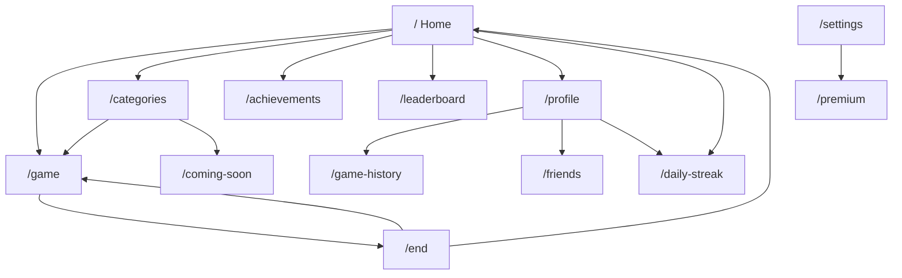

# 05 — Routes & Screens

> Complete route table and screen responsibilities.  
> **Last updated:** 2026-07-08  
> **Source:** `src/App.tsx`

---

## Route table

| Path | Component | Status | Purpose |
|------|-----------|--------|---------|
| `/` | `HomeScreen` | Complete | Hub — Daily Challenge, actions, Daily Streak |
| `/game` | `GameScreen` | Complete | Core gameplay loop |
| `/end` | `EndScreen` | Complete | Session results, rewards, share |
| `/achievements` | `AchievementsScreen` | Complete | 22-badge grid |
| `/categories` | `CategoriesScreen` | Partial | Deck picker (3 playable, 6 locked) |
| `/leaderboard` | `LeaderboardScreen` | Partial | UI complete; stub data |
| `/daily-streak` | `DailyStreakScreen` | Complete | Full-page login rewards |
| `/daily-reward` | `Navigate → /daily-streak` | Complete | Legacy redirect |
| `/settings` | `SettingsScreen` | Complete | Mode, difficulty, sound, haptics |
| `/profile` | `ProfileScreen` | Complete | Name, stats, navigation |
| `/game-history` | `GameHistoryScreen` | Complete | Last 50 sessions |
| `/friends` | `FriendsScreen` | Stub | `ComingSoonScreen` |
| `/premium` | `PremiumScreen` | Stub | `ComingSoonScreen` |
| `/coming-soon` | `ComingSoonPage` | Stub | Locked decks landing |
| `*` | `NotFound` | Complete | 404 |

---

## Navigation map



---

## Screen details

### HomeScreen (`/`)

**File:** `src/pages/HomeScreen.tsx`

- `DailyChallengeCard` — rank, coins, daily game progress
- `HomeActionGrid` — Play, Categories, Medals, Leaderboard
- `DailyStreakHomeCard` + `DailyStreakSheet` — login rewards
- `MissedStreakDialog` — broken streak recovery
- `PremiumTopBar`, `PremiumBottomNav`

### GameScreen (`/game`)

**File:** `src/pages/GameScreen.tsx`

- Reads `GameContext` settings
- Local state: score, streak, phrases, phase, badges queue
- Timer, validation, hints, skip
- Navigates to `/end` with `location.state`

**End state payload:**

```typescript
{
  score: number;
  settings: GameSettings;
  correctCount: number;
  totalRounds: number;
  badgesUnlockedThisRound: Badge[];
}
```

### EndScreen (`/end`)

**File:** `src/pages/EndScreen.tsx`

- Reads `location.state` (redirects if missing)
- Stars, accuracy, coins, XP display
- `saveGameResult`, `addCoins`, `applyRoundCompletion`
- Share, Play Again, badges unlocked list

### CategoriesScreen (`/categories`)

- `DeckGrid` — 9 decks from `decks.ts`
- Locked decks navigate to `/coming-soon`
- Sets category via `GameContext`

### LeaderboardScreen (`/leaderboard`)

- Global tab: stub podium + list + search
- Friends tab: always empty state
- User score from `getUserBestOverall()`

### DailyStreakScreen (`/daily-streak`)

- Full-page version of streak claim UI
- Same logic as home sheet via `dailyStreak.ts`

### SettingsScreen (`/settings`)

- Game mode, difficulty sections
- Sound/haptics toggles
- `PremiumUpsellCard` → `/premium` (stub)

### ProfileScreen (`/profile`)

- Editable display name
- Coins, rank, badge progress, daily streak stat
- Links: history, friends, daily streak

### Stub screens

| Screen | Wrapper |
|--------|---------|
| FriendsScreen | `ComingSoonScreen` |
| PremiumScreen | `ComingSoonScreen` |
| ComingSoonPage | Generic coming soon |

---

## Bottom navigation

**Component:** `PremiumBottomNav`

| Tab | Route |
|-----|-------|
| Home | `/` |
| Play | `/game` |
| Medals | `/achievements` |
| Profile | `/profile` |

---

## Layout conventions

- Max width: `max-w-md` centered
- Dark premium theme (`premium-home.css`, Material 3 tokens)
- Portrait mobile first

---

*Next: [06 — Module map](./06_MODULE_MAP.md)*
