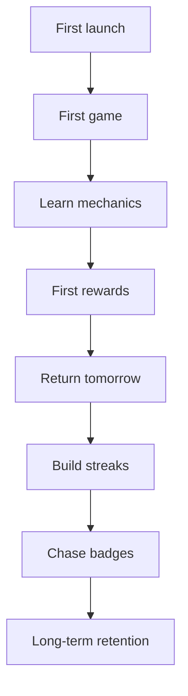

# User Experience — Anu-Sabi

> Intended player journey from first launch to long-term retention.  
> **Last updated:** 2026-07-08

---

## Journey overview

---

## Stage 1 — First launch

**Player arrives at Home (`/`).**

**What they see:**

- Brand: **SabiMo?**
- Hook: *"Can you decode today's gibberish?"*
- **Daily Challenge** card — rank, coins, today's progress
- Large **Play** button
- Secondary: Leaderboard, Categories, Settings
- **Daily Streak** card below actions

**Emotional goal:** Curiosity + clarity — *"This looks fun and I know what to do."*

**Design intent:**

- No account creation
- No tutorial modal — hook line + Play button are enough
- Daily Challenge card doubles as status dashboard (coins, rank)

**Friction to watch:** Many cards on first visit — Play remains visually dominant.

---

## Stage 2 — First game

**Player taps Play → Game (`/game`).**

**What they experience:**

- Circular timer starts
- Speech bubble shows gibberish + *"Read it aloud..."*
- Category and difficulty chips visible
- Answer field + Hint / Skip

**Emotional goal:** Engagement within 10 seconds — first phrase attempted.

**Design intent:**

- Timer creates urgency without instant failure on typo
- Speech bubble frames the puzzle as conversational, not exam-like

**Success signal:** Player submits at least one answer (right or wrong).

---

## Stage 3 — Learning mechanics

**Usually within the first 1–3 phrases.**

**What players discover:**

| Mechanic | How they learn |
|----------|----------------|
| Read-aloud trick | Helper text + social intuition |
| Wrong vs timeout | Wrong = retry; timeout = reveal |
| Streak multiplier | Banner / progress UI when streak grows |
| Hints | Hint button; first-letter clue appears |
| Skip | Reveals answer; streak drops |

**Emotional goal:** *"I get how this works"* — competence.

**Design intent:** Teach through play, not slides. First correct answer triggers badge *Uy May Tama!* when wired.

---

## Stage 4 — First rewards

**End of first 10-round session → End (`/end`).**

**What they see:**

- Headline: *Great Job!* / *New Record!* / *Keep Trying!*
- Star rating from accuracy
- Score, coins earned, XP (display)
- Share score option
- Play Again

**Emotional goal:** Closure + reward — session felt complete.

**Design intent:**

- Coins immediately increase — tangible progress
- Stars give simple performance grade
- Share enables word-of-mouth without online features

**Optional paths after:**

- **Medals** tab — see badge collection
- **Categories** — pick Pinoy vs world
- **Settings** — adjust difficulty

---

## Stage 5 — Building streaks

**Day 2+ return.**

**Two parallel streak systems:**

| System | What it rewards | Where visible |
|--------|-----------------|---------------|
| **Daily Streak (login)** | Opening app and claiming daily reward | Home card, sheet, `/daily-streak` |
| **Daily Challenge** | Completing games today (goal: 3) | Daily Challenge progress bar |
| **In-game streak** | Consecutive correct answers | During game; affects score |

**Emotional goal:** *"I don't want to break my streak."*

**Design intent:**

- Login streak uses variable rewards (Day 5 chest)
- Play streak ensures retention ties to gameplay
- Missed-day recovery reduces rage-quit

---

## Stage 6 — Unlocking achievements

**Sessions 3–20+.**

**Player explores Medals (`/achievements`).**

**Emotional goal:** Collection pride — *"I'm a Pinoy Pride / Hard Core / Daily Legend."*

**Design intent:**

- Badges mark skill milestones, not hours played
- Rank title on profile reflects badge breadth
- End screen can show badges unlocked this session

**Explorer behaviors:**

- Try **Hard** difficulty
- Perfect a **Pinoy-only** or **Mixed** run
- Push **Endless** for high-score badges

---

## Stage 7 — Long-term retention

**Weeks+.**

**Habit loops:**

- Daily Streak claim each morning
- Daily Challenge — three games when possible
- Beat personal best score
- Complete badge sets
- Browse **Game History** — see improvement arc

**Emotional goal:** Identity — *"I'm a SabiMo player."*

**Future retention (Planned):**

- Real friends and leagues (Phase 2)
- Party nights with Bluetooth (Phase 3)
- New deck categories when unlocked

---

## Player personas (inferred — TBD formal validation)

| Persona | Motivation | Best features |
|---------|------------|---------------|
| **Casual decoder** | Quick fun on break | 10-round, Easy, Mixed |
| **Pinoy pride** | Filipino lyrics & sayings | Pinoy deck, Pinoy badges |
| **High-score hunter** | Mastery | Hard, Endless, leaderboard (future) |
| **Collector** | 100% badges | Medals, rank, daily streak badges |
| **Social player** | Compare with friends | **Stub today** — Phase 2+ |

---

## Onboarding gaps (honest)

| Gap | Status |
|-----|--------|
| Formal tutorial | None — by design |
| Explain login vs play streak | Not distinguished in UI copy — **UX debt** |
| Explain rank progression | Partial — visible on profile |
| First-time hint economy | Starting 500 coins may be unexplained |

**TBD — onboarding improvements not yet designed.**

---

*Next: [05 — Screens](05_SCREENS.md)*
