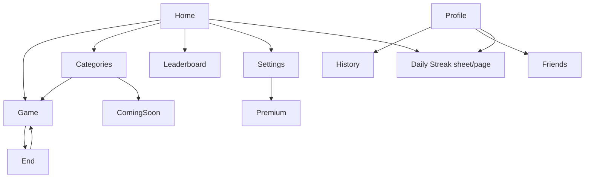

# Screens — Anu-Sabi

> Major screens: purpose, goals, information, and actions. **Experience only** — no implementation.  
> **Last updated:** 2026-07-08

---

## Navigation model

**Bottom nav (persistent on most screens):**

| Tab | Route | Label |
|-----|-------|-------|
| Home | `/` | Home |
| Play | `/game` | Play |
| Medals | `/achievements` | Medals |
| Profile | `/profile` | Profile |

**Additional routes** reached from home grid, profile, or settings.

---

## Home (`/`)

| | |
|---|---|
| **Purpose** | Hub — orient, motivate return, start play |
| **User goal** | Start a game or check daily progress |
| **Information shown** | Brand (SabiMo?), hook line, Daily Challenge (rank, coins, progress), Daily Streak status |
| **Primary action** | **Play** |
| **Secondary actions** | Leaderboard, Categories, Settings; open Daily Streak sheet |
| **Expected flow** | Land → glance progress → Play **or** claim streak → Play |

---

## Game (`/game`)

| | |
|---|---|
| **Purpose** | Core decode loop |
| **User goal** | Guess phrases before timer expires |
| **Information shown** | Gibberish phrase, category/difficulty chips, timer, round progress, streak/multiplier, coin balance (top bar), hint clue if used |
| **Primary action** | Submit answer |
| **Secondary actions** | Hint (50 coins or token), Skip |
| **Expected flow** | Read → type → correct flash **or** retry **or** reveal → next phrase → end after 10 (or endless) |

**Emotional beats:** Tension (timer) → delight (*Tama!*) → relief (reveal on fail).

---

## End (`/end`)

| | |
|---|---|
| **Purpose** | Session closure and reward |
| **User goal** | See how they did; collect rewards |
| **Information shown** | Headline, stars, score, new best flag, accuracy, coins earned, XP, badges unlocked this round |
| **Primary action** | **Play Again** |
| **Secondary actions** | Share score; navigate away via bottom nav |
| **Expected flow** | Results → share (optional) → Play Again **or** Medals/Profile |

**Note:** Reached via navigation state after game — not a bookmarkable entry point.

---

## Categories (`/categories`)

| | |
|---|---|
| **Purpose** | Choose phrase deck / mood |
| **User goal** | Play Pinoy, world, or mixed content |
| **Information shown** | Deck cards (Pinoy, Movies, Mixed playable; others locked) |
| **Primary action** | Select deck → Start Game |
| **Secondary actions** | Back; locked decks → Coming Soon |
| **Expected flow** | Browse decks → select → Game with chosen category |

---

## Achievements / Medals (`/achievements`)

| | |
|---|---|
| **Purpose** | Badge collection and progress |
| **User goal** | See what they've unlocked; find next goals |
| **Information shown** | Grid of 22 badges, locked/unlocked state, progress card |
| **Primary action** | Browse badges |
| **Secondary actions** | Bottom nav to other sections |
| **Expected flow** | Review collection after strong session or from nav |

---

## Leaderboard (`/leaderboard`)

| | |
|---|---|
| **Purpose** | Competitive comparison |
| **User goal** | See ranking vs others |
| **Information shown** | Podium, player list, search; Friends tab (empty) |
| **Primary action** | Browse global list |
| **Secondary actions** | Search by name; switch tabs |
| **Expected flow** | Check standing → motivated to play |

**Product honesty:** Global list uses **stub data** today — not real players. Phase 2 will replace with live data.

---

## Profile (`/profile`)

| | |
|---|---|
| **Purpose** | Player identity and stats |
| **User goal** | See progress; manage name; dig into history |
| **Information shown** | Display name, rank, coins, daily streak stat, badge progress |
| **Primary action** | Edit display name |
| **Secondary actions** | Game History, Friends & Leagues, Daily Streak |
| **Expected flow** | Check identity → history **or** streak details |

---

## Settings (`/settings`)

| | |
|---|---|
| **Purpose** | Control how the game plays and feels |
| **User goal** | Set difficulty, mode, sound, haptics |
| **Information shown** | Game mode (10-round / endless), difficulty, toggles, Premium upsell |
| **Primary action** | Change mode or difficulty |
| **Secondary actions** | Toggle sound/haptics; Upgrade Premium → stub |
| **Expected flow** | Adjust challenge → Play |

---

## Daily Streak (`/daily-streak`)

| | |
|---|---|
| **Purpose** | Full-page login reward experience |
| **User goal** | Claim today's reward; view 5-day cycle |
| **Information shown** | Reward cards per day, calendar, streak stats, claim CTA |
| **Primary action** | **Claim** today's reward |
| **Secondary actions** | Back; view calendar |
| **Expected flow** | Open from home card or profile → claim → celebration overlay |

**Also available as bottom sheet from Home** — same purpose, lighter context.

---

## Game History (`/game-history`)

| | |
|---|---|
| **Purpose** | Past session log |
| **User goal** | Review performance over time |
| **Information shown** | Up to 50 sessions — date, mode, difficulty, category, score |
| **Primary action** | Scroll list |
| **Secondary actions** | Back to profile |
| **Expected flow** | Reflect on improvement |

---

## Friends (`/friends`) — Stub

| | |
|---|---|
| **Purpose** | Future social play |
| **User goal** | Connect with friends (**not available**) |
| **Message** | *"Friends and leagues are on the way..."* |
| **Status** | **Stub** — Phase 2 |

---

## Premium (`/premium`) — Stub

| | |
|---|---|
| **Purpose** | Future subscription |
| **User goal** | Upgrade (**not available**) |
| **Message** | *"SabiMo Premium with exclusive themes and daily challenges is coming soon."* |
| **Status** | **Stub** — Phase 2 / monetization TBD |

---

## Coming Soon (`/coming-soon`)

| | |
|---|---|
| **Purpose** | Set expectations for locked decks |
| **User goal** | Understand unavailable content |
| **Information shown** | Coming Soon title + message |
| **Expected flow** | Tap locked deck in Categories → read → back |

---

## 404 (`/*`)

| | |
|---|---|
| **Purpose** | Recover from bad links |
| **User goal** | Get back to app |
| **Primary action** | Navigate home |

---

## Screen flow diagram

---

*Next: [06 — Content strategy](06_CONTENT_STRATEGY.md)*
