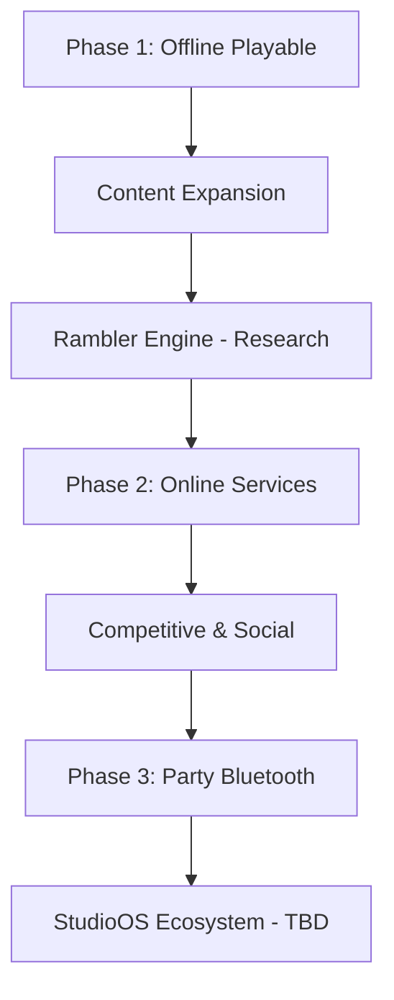

# Roadmap Narrative — Anu-Sabi

> *Why* the product evolves — not just *what* ships.  
> **Last updated:** 2026-07-08  
> **Feature checklist:** [ROADMAP.md](../roadmap/ROADMAP.md)

---

## The journey

Each step answers a question the previous step left open.

---

## Now — Phase 1: Offline playable

**Question we're answering:** *Can this game be fun and complete on a phone with no account and no internet?*

**Why this comes first:**

- The core hook (read gibberish → decode phrase) must work before any server investment
- Filipino + world content already fills 500 puzzles — enough for launch
- App store distribution needs a solid single-player SKU
- Team can iterate on feel, balance, and content quality without backend complexity

**Player promise:** Download, play, progress — anywhere.

**Milestone exit:** Offline install → full session → persisted progress → repeatable daily habit.

**What's intentionally deferred:** Real leaderboard, friends, cloud save, Bluetooth party.

---

## Next — Content expansion (within Phase 1)

**Question:** *Do players run out of novelty?*

**Why it matters:**

- 500 phrases are substantial but finite for heavy players
- Stub decks (Funny, Songs, Love, Sports, Food, TV) signal appetite for themed packs
- Quality issues (e.g. mismatched gibberish) erode trust in the mechanic

**Likely work:**

- Author more hand-curated phrases
- Unlock stub decks when content ready
- Quality bar: every line must "click" when read aloud

**Not required for first offline milestone** but strengthens retention before Phase 2.

---

## Research — Rambler Engine

**Question:** *Can puzzles be generated at scale instead of hand-written?*

**Status:** **Planned — research only** — not in repository.

**Why it exists as a concept:**

- Manual authoring does not scale to daily puzzles or infinite variety
- Procedural phonetic puzzles could power live ops later

**Why it is NOT blocking Phase 1:**

- 500 static phrases prove the mechanic
- Engine risk is high — research belongs parallel to ship, not on critical path

Detail: [RESEARCH_NOTES.md](../research/RESEARCH_NOTES.md)

---

## Phase 2 — Online services

**Question:** *How do players compare, connect, and protect progress across devices?*

**Why Phase 2 follows offline:**

- Offline proves fun; online proves business and community longevity
- Stub UI (leaderboard, friends, premium) already sets player expectations
- Backend unlocks: real rankings, accounts, cloud save, analytics, IAP infrastructure

**Player promise:** *My scores matter. My friends see me. My progress is safe.*

**Planned capabilities (not implemented):**

- Backend API and authentication
- Live leaderboard replacing stub data
- Friends & leagues
- Cloud sync
- Analytics
- Premium subscription (real)
- Push notifications — **TBD**

**Why not sooner:** Cost, privacy, ops complexity — and Phase 1 must stand alone.

---

## Competitive & social depth (Phase 2 extension)

**Question:** *What do players do after they can connect?*

**Why it matters:**

- Word games thrive on comparison and shared moments
- Daily Challenge and rank already prime competitive identity

**Planned (not designed in detail):**

- Leagues, seasons, friend challenges — **TBD**
- Daily events with shared puzzles — **Concept**

---

## Phase 3 — Party mode (Bluetooth)

**Question:** *How do we capture the party-game moment in person?*

**Why Bluetooth / local multiplayer:**

- The read-aloud mechanic is naturally social — groups already solve these puzzles together
- Local play avoids server latency and works at parties with poor Wi‑Fi
- Differentiates from solo-only word apps

**Player promise:** *Pass the phone or connect nearby — play together in one room.*

**Status:** **Planned — not in repository.** No lobby, pairing, or sync code exists.

**TBD:** Capacitor plugin choice, host/join flow, round structure.

---

## StudioOS ecosystem

**TBD — requires confirmation.**

StudioOS is the **documentation and project container** for Anu-Sabi in this repository. Whether it becomes a player-facing ecosystem (cross-app accounts, shared engine, content platform) is **not documented in product source**.

Document as **Concept** until product team confirms.

---

## How to read this alongside engineering roadmap

| Document | Focus |
|----------|-------|
| This narrative | **Why** phases exist |
| [ROADMAP.md](../roadmap/ROADMAP.md) | **What** is done / next / planned |
| [DEVELOPER_BIBLE.md](../DEVELOPER_BIBLE.md) | **How** to build |

---

*Next: [11 — Product decisions](11_PRODUCT_DECISIONS.md)*
