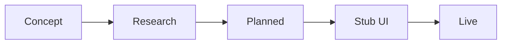

# Future Vision — Anu-Sabi

> Ideas already discussed or stubbed — **clearly labeled by maturity**.  
> **Last updated:** 2026-07-08  
> **Rule:** Nothing here is implemented unless marked otherwise.

---

## Maturity labels

| Label | Meaning |
|-------|---------|
| **Live** | In production codebase |
| **Stub** | UI placeholder only |
| **Planned** | Committed direction, no code |
| **Research** | Exploratory spec / notes |
| **Concept** | Idea mentioned, not designed |
| **TBD** | Not yet decided |

---

## Phase 2 — Online (Planned)

| Idea | Label | Notes |
|------|-------|-------|
| Backend API | **Planned** | Not in repository |
| User accounts / auth | **Planned** | |
| Real online leaderboard | **Stub** today → **Planned** | `leaderboard.ts` mock data |
| Friends & leagues | **Stub** | `ComingSoonScreen` |
| Cloud save / cross-device sync | **Planned** | |
| Dynamic phrase loading | **Planned** | API-delivered content |
| Analytics / telemetry | **Planned** | `docs/10_ANALYTICS.md` is TBD template |
| Push notifications | **TBD** | Mentioned in requirements backlog |
| Premium subscription | **Stub** → **Planned** | Copy: themes, daily challenges |
| Pro deck IAP | **Stub** | `DeckPromoBanner` only |
| In-app purchases | **Planned** | No store integration |

---

## Phase 3 — Party / Bluetooth (Planned)

| Idea | Label | Notes |
|------|-------|-------|
| Bluetooth local multiplayer | **Planned** | Product phase confirmed |
| Party lobby | **TBD** | Not designed |
| Host / join flow | **TBD** | |
| Shared round sync | **TBD** | |

---

## Content & engine (Research / Planned)

| Idea | Label | Notes |
|------|-------|-------|
| **Rambler Engine** | **Research** | Procedural phonetic puzzles — `docs/04_RAMBLER_ENGINE.md` draft |
| Procedural puzzle generation | **Research** | Pipeline concept only |
| LLM-assisted phrase authoring | **Concept** | Parking lot / research |
| User-generated puzzles | **Concept** | No submission flow |
| Seeded daily puzzle | **Concept** | Needs engine or server |
| Additional decks (Funny, Songs, etc.) | **Stub** UI → **Planned** content |
| Content quality scoring | **TBD** | |

---

## Progression (TBD / Partial)

| Idea | Label | Notes |
|------|-------|-------|
| Persistent XP / levels | **Partial** | XP display only on end screen |
| Player level system | **TBD** | |
| Seasonal rank resets | **TBD** | |

---

## Social & live ops (Concept / Planned)

| Idea | Label | Notes |
|------|-------|-------|
| Daily events (global puzzle) | **Concept** | |
| Friend challenges | **Concept** | |
| Leagues / seasons | **Concept** | Friends stub mentions leagues |
| Share-to-viral loops | **Live** | Share score on end screen |

---

## Platform (Planned / TBD)

| Idea | Label | Notes |
|------|-------|-------|
| PWA / service worker | **Planned** | `NEXT_STEPS.md` |
| Play Store / App Store launch | **Planned** | Phase 1 milestone |
| iOS + Android parity | **Live** scaffold | Both Capacitor projects exist |
| Localization (full UI) | **TBD** | |
| StudioOS cross-app ecosystem | **Concept** | **TBD — requires confirmation** |

---

## Monetization future (TBD)

| Idea | Label | Notes |
|------|-------|-------|
| Pricing model | **TBD** | |
| Subscription tiers | **TBD** | |
| Ads | **TBD** | Not in codebase |
| Ethical monetization policy | **TBD** | |

---

## Research platform (Research)

From `docs/08_RESEARCH.md` — anonymous solve data for difficulty tuning:

```json
{
  "timeToSolve": 0,
  "attempts": 0,
  "hintUsed": false,
  "correct": true
}
```

**Status:** **Research** — no telemetry collected today.

---

## How ideas graduate



Documentation will be updated as ideas move right — never skip stages in writing.

---

*Return to: [Product Manual](PRODUCT_MANUAL.md)*
