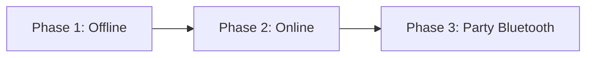

# Roadmap — Anu-Sabi

> Product phases, current milestone, and backlog.  
> **Status labels:** See [README — Conventions](../../README.md#conventions)  
> **Last updated:** 2026-07-08

---

## Product phases (confirmed)

Anu-Sabi ships in **three product phases**. Only **Phase 1** is in active development.

| Phase | Name | Goal | Status |
|-------|------|------|--------|
| **1** | **Offline mode** | Fully playable without network; single-player local progression | **Active** — first milestone |
| **2** | **Online mode** | Accounts, backend, real leaderboard, cloud sync, social | **Planned** — not in repository |
| **3** | **Party mode (Bluetooth)** | Local multiplayer with nearby players via Bluetooth | **Planned** — not in repository |

---

## Phase 1 — Offline mode (current milestone)

**First milestone:** Make the app **offline playable** and shippable as a standalone mobile game.

### What Phase 1 means

- Core game loop works **without any network connection**
- All progression stored in **`localStorage`** (no backend required)
- Capacitor Android/iOS builds run from local `dist/` assets
- Single-player experience only — no real online ranking or multiplayer

### Already implemented (Phase 1 scope)

| Feature | Status |
|---------|--------|
| Core gameplay (timer, validation, skip) | Complete |
| 10-round and endless modes | Complete |
| Easy / medium / hard difficulty | Complete |
| Pinoy / world / mixed categories (500 phrases) | Complete |
| Streak score multiplier | Complete |
| Coin economy | Complete |
| Hint system (coins + tokens) | Complete |
| 22-badge achievement system | Complete |
| Rank from badges | Complete |
| Daily Streak (5-day login cycle) | Complete |
| Daily Challenge progress card | Complete |
| Profile, settings, game history | Complete |
| End screen (score, stars, share, badges) | Complete |
| Capacitor Android/iOS scaffold | Complete |
| Sound + haptic feedback | Complete |

### Phase 1 — remaining work (ship offline)

*Not yet done; required to close the offline milestone.*

| Item | Priority | Notes |
|------|----------|-------|
| Verify full offline play on device (no network) | P0 | Capacitor build + airplane mode test |
| Play Store / App Store release pipeline | P0 | TBD — requires confirmation |
| Update `index.html` metadata | P1 | Title, og tags |
| Fix known gaps (`first-game` badge, hint token UI) | P1 | See [technical debt](../developer/09_TECHNICAL_DEBT.md) |
| Phrase data quality pass | P1 | e.g. phrase id 12 |
| Manual QA checklist pass | P1 | [QA_STRATEGY.md](../testing/QA_STRATEGY.md) |
| Automated tests for core game logic | P2 | `validateAnswer`, multipliers, badges |
| PWA / service worker (optional) | P2 | Improves web offline install |

### Explicitly out of Phase 1 scope

| Item | Deferred to |
|------|-------------|
| Backend API | Phase 2 |
| User accounts / auth | Phase 2 |
| Real online leaderboard | Phase 2 (stub UI may remain) |
| Friends & leagues | Phase 2 |
| Cloud save / cross-device sync | Phase 2 |
| Bluetooth party / local multiplayer | Phase 3 |
| Analytics SDK | Phase 2 (TBD) |

### Phase 1 exit criteria (milestone)

- [ ] App installs and runs on Android and/or iOS **with no network**
- [ ] Full game session (play → end → rewards) completes offline
- [ ] Progress persists across app restarts via `localStorage`
- [ ] Release build process documented and repeatable
- [ ] No critical bugs in core loop (smoke test passed)

---

## Phase 2 — Online mode (planned)

**Status:** **Planned — not in repository**

**Goal:** Connect the app to backend services for accounts, real competition, and cross-device progress.

| Capability | Current state |
|------------|---------------|
| Backend API | Planned — not in repository |
| User accounts / auth | Planned — not in repository |
| Real online leaderboard | Stub (`leaderboard.ts`) |
| Friends & leagues | Stub (`ComingSoonScreen`) |
| Cloud save / cross-device sync | Planned — not in repository |
| Dynamic phrase loading from API | Planned — not in repository |
| Analytics | Planned — not in repository |
| Push notifications | Planned — not in repository |
| Premium / IAP | Stub (`ComingSoonScreen`) |

**Do not implement Phase 2 features until Phase 1 offline milestone is complete.**

---

## Phase 3 — Party mode / Bluetooth (planned)

**Status:** **Planned — not in repository**

**Goal:** Enable **local multiplayer** — nearby players connect via **Bluetooth** for shared party sessions.

| Topic | Status |
|-------|--------|
| Bluetooth pairing / session host | Planned — not in repository |
| Multi-device game sync | Planned — not in repository |
| Party lobby UI | Planned — not in repository |
| Capacitor Bluetooth plugin selection | TBD — requires confirmation |

**No Bluetooth or party-mode source code exists today.** Details will be documented when Phase 3 begins.

---

## Backlog (Phase 1 polish)

*Cross-cutting improvements; not phase-specific.*

| Item | Priority |
|------|----------|
| Consolidate dual streak fields in profile | Medium |
| Remove duplicate badge unlock checks | Low |
| TypeScript strict mode | Low |
| Rambler Engine (procedural content) | Planned — research only (post–Phase 1) |

---

## Out of scope

- Extracting Rambler Engine to standalone package (unless scheduled later)
- Phase 2/3 implementation before Phase 1 milestone ships

---

*See also: [VISION.md](../vision/VISION.md), [CURRENT_IMPLEMENTATION.md](../implementation/CURRENT_IMPLEMENTATION.md), [PRODUCT_REQUIREMENTS.md](../requirements/PRODUCT_REQUIREMENTS.md)*
